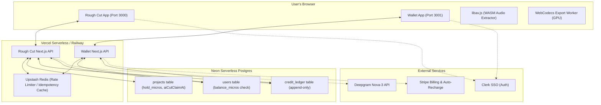

# Production Architecture Review: SUBI Web Application

## Overall Grade: A-

The SUBI architecture is exceptionally well-engineered for a cost-effective, high-scale launch. The local-first video processing model dramatically reduces standard hosting costs, while the use of Neon Postgres with single-statement CTEs and DB check constraints provides strong concurrency guarantees in serverless environments. 

However, there are a few platform-level limitations (e.g., Chromium-only export support) and pending product decisions (e.g., auto-recharge notifications and the monthly grant model) that should be addressed before general availability.

---

## 1. High-Level Design & Topology

* **Data flow is optimized**: Media bytes bypass the web servers. Raw video remains entirely on the client, and only compressed audio tracks (~100 MB per hour) are uploaded to Vercel Blob and forwarded to Deepgram, minimizing bandwidth charges and eliminating server-side storage costs.
* **Separation of Billing Authority**: Under ADR `0001`, Stripe checkout, webhooks, and auto-recharge are isolated in `apps/wallet`. `apps/rough-cut` spends credits but does not talk directly to Stripe.

---

## 2. Critical Issues (Block Launch)

| # | Issue | Risk | Mitigation |
|---|-------|------|------------|
| 1 | **Chromium-Only Export Limitation** | **High** (Business/UX) — Firefox and Safari users cannot export finished MP4s because WebCodecs and the File System Access API are not fully supported. | 1. Implement clear UI banners/guards on onboarding to inform non-Chromium users. 2. Add a fallback exporter that creates a standard `<a download>` blob URL for browsers supporting WebCodecs but lacking the File System Access API. |
| 2 | **Stripe Auto-Recharge Decline Notification Deficit** | **High** (Business/Billing) — The cron job sweeps and charges card-on-file off-session. If it fails 3 times, auto-recharge is disabled, but no notification channel (email/SMS) is implemented, risking silent user lockout when balance hits $0. | Select and implement a notification channel (e.g., integration with Resend or Postmark) inside `notifyAutoRecharge` (in `apps/wallet/src/lib/notifications.ts`) before public launch. |
| 3 | **Unverified Deepgram Callback Endpoint** | **Medium** (Security) — The callback route `/api/transcribe/callback` relies on a random query token (`transcriptCallbackToken`) in the URL. If leaked, an attacker could POST arbitrary JSON payload to register ready/failed projects. | 1. Verify Deepgram's webhook request signature headers or validate that the request originates from Deepgram's verified IP address ranges. 2. Keep callback token lifespan narrow. |

---

## 3. Warnings (Fix Before Scale)

| # | Issue | Impact | Recommendation |
|---|-------|--------|----------------|
| 1 | **Local Video Linkage State** | **Medium** — Since video files are never stored server-side, if a user renames or moves their local file, they must reselect it. The app checks duration, but does not track file size/hash, meaning mismatched videos can cause timeline drift. | Record basic local file metadata (name, size, type) alongside duration in the database. Warn users during re-selection if metadata does not match. |
| 2 | **Open Question: Monthly Member Grant** | **Medium** — The Skool community monthly grant is currently represented by a temporary placeholder in USD micros. If not finalized, it could lead to incorrect billing metrics. | Finalize the client discussion regarding the monthly grant structure (credits vs free hours) and refactor `ensureMonthlyGrant` (in `apps/rough-cut/src/lib/credits.ts`) accordingly. |
| 3 | **Sentry Off by Default** | **Low** — Observability is silent in production until environment variables are explicitly wired, leading to potential blind spots during initial user onboarding. | Wire `SENTRY_DSN` and `NEXT_PUBLIC_SENTRY_DSN` in Vercel/Railway environment variables immediately on deployment. |

---

## 4. Strengths

1. **Massive Cloud Cost Savings**: Shifting video encoding (via WebCodecs/GPU) and decoding entirely to the client's browser eliminates typical server rendering/transcoding fees and object storage costs (e.g., S3 egress).
2. **Robust Concurrency Design**:
   - The database-level constraint `CHECK (balance_micros >= 0)` acts as an iron-clad guard against negative balances and concurrent double-spends without requiring heavy, stateful persistent transaction blocks.
   - The atomic transaction claim logic (`claimAiCutSlot`) handles concurrent POST runs on the same project elegantly, preventing race conditions.
3. **Connection Establishment Retries**: `withDbRetry` wraps database reads and safely retries on transient connection issues (DNS timeouts, socket termination, TLS handshake stalls) without risk of duplicating mutations.
4. **Stateless Scalability**: The Next.js apps are completely stateless and serverless-compatible, backed by Clerk for SSO authentication and Upstash Redis for distributed rate-limiting.

---

## 5. Action Items

- [ ] Implement email decline notifications in `notifyAutoRecharge` (in `apps/wallet/src/lib/notifications.ts`) using a service like Resend.
- [ ] Add a standard download-fallback wrapper for browsers supporting WebCodecs but lacking `showSaveFilePicker` (Firefox/Safari support roadmap).
- [ ] Resolve the monthly grant pricing ADR.
- [ ] Wire Sentry environment variables in production environment.
- [ ] Implement signature validation for the Deepgram callback API route.
