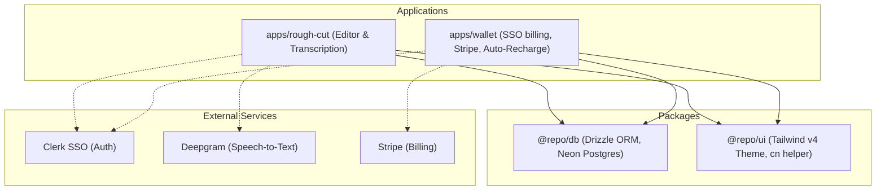
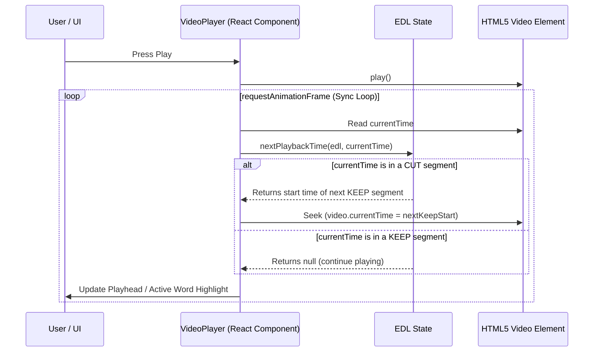

# SUBI — Architecture Overview & Cost Model

This document explains the architecture of the SUBI web application, how it functions, how it achieves massive bandwidth and cloud cost savings, and the inner workings of its backend systems.

---

## 1. What the App Does & How It Works

SUBI (specifically the **Rough Cut** application) is a web-based, text-style video editor designed to automate the rough-cut stage of video production. Instead of dragging and splitting video clips on a traditional timeline, users edit their video by editing the spoken transcript—like editing a text document.

### Core User Flow
1. **Import:** The user selects a raw video file from their local drive using a native file picker. **The video file is never uploaded to any server.**
2. **Audio Extraction:** The application extracts the audio track from the video file locally in the browser using `libav.js` (FFmpeg compiled to WebAssembly).
3. **Transcription:** The extracted audio track (which is a fraction of the size of the original video) is sent to a proxy Next.js API endpoint, which forwards it to **Deepgram Nova-3 (Batch API)**. Deepgram returns a word-level transcript containing precise start/end timestamps for every word.
4. **Auto-Cut Proposal:** The application runs client-side algorithms on the word-level transcript to automatically propose cuts:
   - **Silence Detection:** Word gaps exceeding a threshold (e.g., 0.7s) are flagged as "dead air."
   - **Retake Detection:** Repeated sentences or phrases are flagged using sentence similarity checks, keeping only the final (successful) take.
   - **Repetition Detection:** Word stutters or repeated words are flagged for removal.
5. **Text-Based Editing:** The user reviews the transcript. Words proposed for cutting are shown with strikethrough styling. The user can manually delete words (cutting them) or restore cut segments. The edit state is saved as an **Edit Decision List (EDL)**.
6. **Real-time Preview:** The user previews the edited video in a customized video player. The player automatically skips over cut segments in real-time.
7. **Local Render & Export:** When the user clicks "Export," the browser decodes and encodes the video locally in a Web Worker using the **WebCodecs API** via the `mediabunny` wrapper, writing the finished MP4 directly to the user's hard drive.

---

## 2. Overall Monorepo Architecture

SUBI is built as a **Turborepo monorepo** using npm workspaces. This architecture separates concerns while sharing critical code (database schemas, UI design tokens, etc.) across the ecosystem.



### Monorepo Components
* **`apps/rough-cut`**: The Next.js application hosting the landing pages, dashboard, editor studio, cut-preview player, and WebCodecs export worker.
* **`apps/wallet`**: The Next.js application hosting the billing dashboard. It is the sole authority for Stripe checkout sessions, webhooks, and the ledger sweep for off-session auto-recharges.
* **`packages/db`**: A shared library containing the Drizzle ORM schema, migrations, and connection utility. Sharing this guarantees that both apps share a single source of truth database.
* **`packages/ui`**: A thin package sharing design tokens (CSS-first variables for Tailwind CSS v4) and common styling helpers like `cn()` (clsx + tailwind-merge).

---

## 3. How the Video Preview Works (Cut Preview Playback)

The real-time preview of the rough cut happens completely in the browser's native `<video>` element, driven by the **EDL (Edit Decision List)**.



### The Technical Mechanism
1. **The EDL Structure:** The EDL is represented as a JSON array of chronological segments:
   ```json
   {
     "segments": [
       { "start": 0.0, "end": 4.5, "status": "keep", "reason": null },
       { "start": 4.5, "end": 6.8, "status": "cut", "reason": "silence" },
       { "start": 6.8, "end": 15.2, "status": "keep", "reason": null }
     ]
   }
   ```
2. **The Render Loop:** Instead of relying on the slow, native `timeupdate` HTML5 event (which fires at ~4Hz), the custom [video-player.tsx](file:///c:/Users/USER/OneDrive/Desktop/SUBI-web-app/apps/rough-cut/src/components/video-player.tsx) uses a `requestAnimationFrame` loop (running at display refresh rate, ~60Hz or higher).
3. **On-the-fly Skipping:** In every frame, the player evaluates the current time. If it enters a segment marked as `"cut"`, it calls `nextPlaybackTime(edl, currentTime)` to identify the start of the next `"keep"` segment, and instantly updates `video.currentTime` to seek forward.
4. **Benefits:** 
   - The user experiences a seamless edit preview without needing to render or download anything.
   - Clicking a word in the transcript instantly seeks the video to that word's start timestamp.

---

## 4. How Bandwidth Costs Are Saved

Traditional cloud-based video editors require users to upload their raw footage to cloud storage (like AWS S3) and download the rendered output. This is incredibly slow and expensive.

### Bandwidth Comparison

| Metric | Cloud-First Editor (Descript, Gling) | Local-First Editor (SUBI) |
|---|---|---|
| **Video Upload** | Raw Video File (e.g., **10 GB - 30+ GB** for 1 hour) | **0 GB** (Files stay on local disk) |
| **Video Download** | Rendered Video File (e.g., **1 GB - 5 GB**) | **0 GB** (Rendered locally to Downloads) |
| **Data Transmitted** | Up to **35+ GB** over the internet | **~100 MB** (Only extracted audio) |
| **Bandwidth Reduction** | 0% | **97.0% - 99.7%** |

### The Savings Mechanism
1. **Local Extractor:** When a video is imported, the browser runs a WebAssembly wrapper around FFmpeg (`libav.js`). It decodes the container, extracts only the compressed audio track, and discards the massive video packets.
2. **Audio-Only Upload:** Instead of uploading gigabytes of high-definition video frames, the app only sends the compressed audio track (~100 MB for a 1-hour session) to the transcription server.
3. **No Cloud Storage:** The cloud server never stores the source video files or the exported video files, saving 100% of cloud storage fees and data egress/ingress charges.

---

## 5. Cloud Cost-Effectiveness

SUBI's local-first architecture shifts the computational and storage burdens from the platform's cloud servers to the user's local machine. This creates a highly profitable and scalable cost model.

```
+-------------------------------------------------------+
|                 PLATFORM CLOUD SERVERS                |
|  - Web Hosting (Railway)                              |
|  - Postgres Metadata & EDL JSON (Neon)                |
|  - Speech-To-Text API Proxy                           |
+--------------------------+----------------------------+
                           | ~100MB Audio Track Only
                           v
+-------------------------------------------------------+
|                    USER'S BROWSER                     |
|  - WA FFmpeg Audio Extraction                         |
|  - Real-Time EDL Preview                              |
|  - WebCodecs GPU-Accelerated Decoding & Encoding      |
|  - Direct File Writing via File System Access API     |
+-------------------------------------------------------+
```

### The Cost Breakdown

* **Fixed Cloud Costs (~$25–$40/month):**
  - Next.js apps & Postgres database are hosted on Railway/Neon. Because the servers only route lightweight JSON metadata (transcripts and EDL arrays) and proxy audio files, they require minimal compute and RAM.
* **Variable Session Costs (~$0.26 per hour of video):**
  - The only variable cost incurred by the platform is the **Deepgram transcription charge** ($0.0043 per minute of audio, or ~$0.26 per hour).
* **Computational Delegation (Free to Platform):**
  - **Decoders & Encoders:** The browser's native WebCodecs API utilizes the user's hardware decoders/encoders (GPU acceleration).
  - **Disk I/O:** Reading raw files and writing final MP4s runs directly on the client's SSD.
  - **Memory:** Client RAM holds the decoded video frames.
  - **CPU time:** Background rendering runs in a client Web Worker, taking 0% of server CPU.

---

## 6. Deep Dive: Backend & Ledger Architecture

The backend focuses on secure authentication, project synchronization, and a strict money ledger system.

### Authentication & Single Sign-On (SSO)
Auth is managed by **Clerk** configured with Multi-Domain SSO. 
- A user signs up/in via the Wallet app (`apps/wallet`).
- When navigating to the editor (`apps/rough-cut`), Clerk shares the session, allowing a seamless user experience across domain names without re-logging in.
- Access to the ecosystem is protected by an Access Code Gate linked to a Skool community.

### Neon Postgres Database Schema
The database uses Drizzle ORM to interface with Neon Postgres. The critical tables are:
1. **`users`**: Stores metadata, Stripe customer IDs, and the cached credit balance in **USD micros** (`balanceMicros`).
2. **`projects`**: Stores the name, transcription status, Deepgram raw JSON `transcript`, and the edit decisions `edl` JSON.
3. **`credit_ledger`**: An append-only ledger tracking all credit changes (purchases, transcription charges, refunds, grants) in USD micros.

### The USD Micros Ledger System
To avoid floating-point rounding errors and accommodate various currencies, money is tracked as an integer in **USD micros** ($1.00 = 1,000,000 micros).
* **The Concurrency & Overdraft Guard:**
  Because the serverless Neon HTTP driver does not support persistent transactions, concurrency is protected by a database CHECK constraint:
  ```sql
  ALTER TABLE users ADD CONSTRAINT users_balance_micros_nonneg CHECK (balance_micros >= 0);
  ```
  Every deduction is executed as a single, atomic SQL statement using Common Table Expressions (CTEs). If a concurrent spend or reservation pushes `balanceMicros` below zero, the Postgres engine throws a CHECK constraint violation (`23514`), rolling back the entire statement.

### The Hold & Settle Flow (Transcription Jobs)
To prevent double-kickoffs and handle mid-job failures, transcription billing uses a hold-and-settle mechanism:

```mermaid
sequenceDiagram
    participant C as Rough Cut App
    participant DB as Neon Postgres
    participant DG as Deepgram API

    C->>DB: reserveCredits(projectId, estimatedDuration)
    Note over DB: Sets projects.hold_micros<br/>Deducts hold from users.balance_micros<br/>Writes ledger row 'transcription'
    DB-->>C: Credits Reserved (or Insufficient/Already Held)

    C->>DG: Dispatch Audio
    alt Job Succeeds
        DG-->>C: Callback with Transcript & actual_duration
        C->>DB: settleHold(projectId, actualDuration)
        Note over DB: Clears projects.hold_micros<br/>Adjusts balance with refund or additional charge
    alt Job Fails / Server Crashes
        Note over C: Hold sits stale
        Note over DB: reclaimStaleHold() (Sweep/Cron)<br/>Clears hold & issues full refund
    end
```

1. **Reserve:** When a transcription starts, `reserveCredits()` calculates the estimated charge based on client-reported video duration. It writes a negative entry to `credit_ledger` and populates `projects.hold_micros`.
2. **Settle:** When Deepgram returns the transcription, `settleHold()` reads the actual duration. It clears `hold_micros` and calculates the true charge:
   - If the actual duration was shorter than estimated, the user receives an automatic refund for the difference.
   - If it was longer, they are charged the remaining balance (up to their current funds, clamped at a zero balance).
3. **Reclaim:** If a node crashes and fails to call settle, a sweep function `reclaimStaleHold()` runs on projects where the hold has sat untouched beyond `STALE_HOLD_MS = 10_000` (10 seconds) while not in a "processing" state, restoring the held credits to the user.

### Off-Session Stripe Auto-Recharge
If a user enables auto-recharge:
1. They save a credit card during checkout, generating a Stripe Customer ID and Payment Method ID saved in the `users` table.
2. A server cron job periodically runs `selectAutoRechargeCandidates()`, seeking users whose `balanceMicros < autorechargeThresholdMicros`.
3. The server charges the saved payment method off-session using Stripe's PaymentIntents API.
4. Upon successful charge, a webhook updates the user's `balanceMicros` and appends a ledger entry of reason `'auto_recharge'`.
5. Safety controls include:
   - Rolling 24-hour transaction limit (max 3 auto-recharges).
   - Decline counter: If 3 consecutive charges decline, auto-recharge is disabled and the user is notified.
