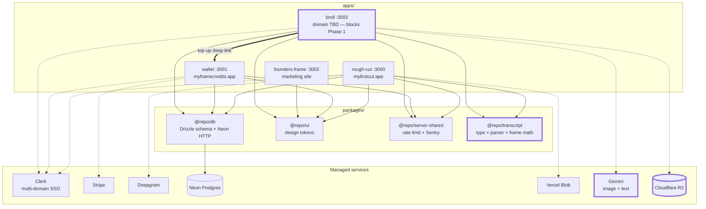
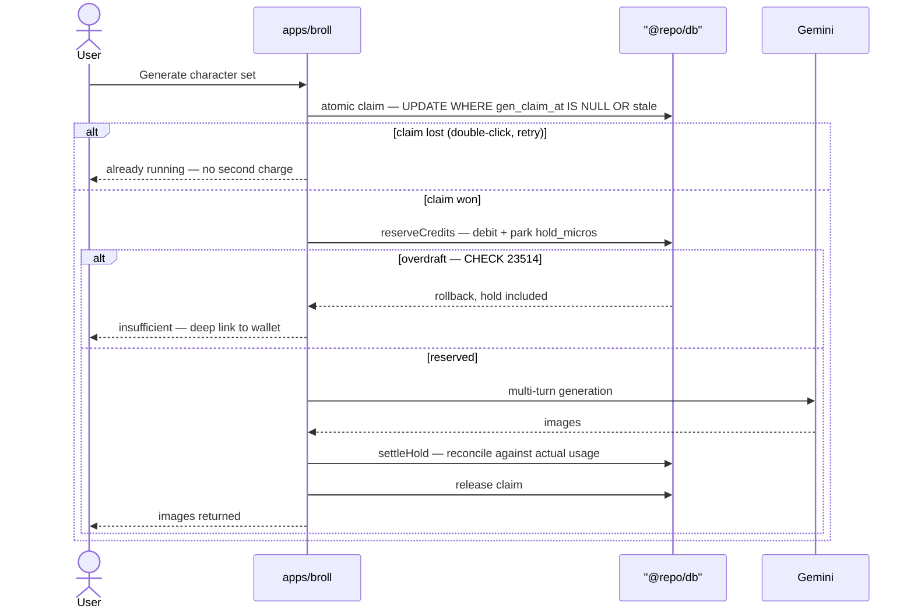
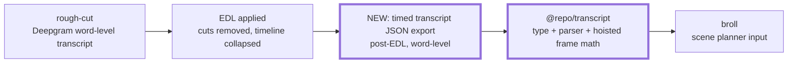
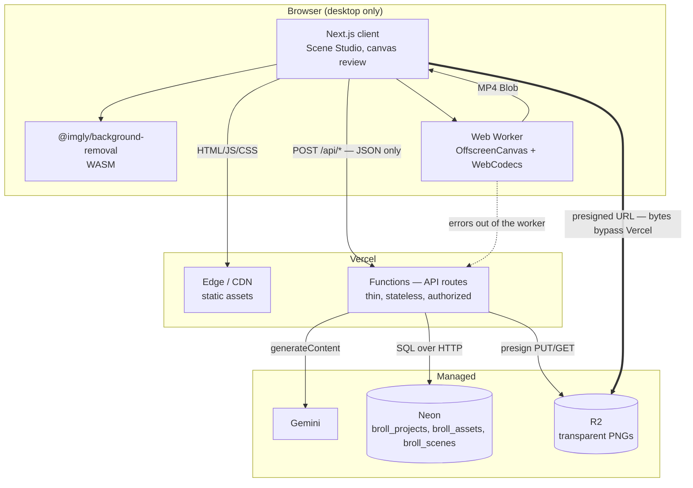

# B-Roll Generator — High Level Design

**Status:** Revision 3. **Phase 0 complete — both spikes passed.** See
[rationale.md](./rationale.md) for measured results and the nine spec changes
Phase 0 forced.
**Companion:** `broll-generator-spec.md` — the app-internal technical spec.
**Not yet in the repo.** Where this document overrides it, the override is stated
inline and is authoritative; check the spec in before Phase 1 so the overrides are
reviewable against what they replace.

This document covers what the app-internal spec does not: how `apps/broll` sits
inside the SUBI monorepo, what it shares, what it owns alone, and which existing
conventions it must bend to. The spec's §6 describes b-roll as if it were a
standalone product. It isn't — and the differences are where the design risk
lives.

**Revision 2** resolved four decisions that gated the Phase 1 migration and
corrected a check-then-act money flow (§2).

**Revision 3** folds in Phase 0. Every technical risk the design bet on has been
measured and holds: client-side encoding, segmentation on generated characters in
both shipping styles, multi-turn identity, and the chart-honesty guarantee. No
server-side render fallback is needed and no manual cutout touch-up path is
needed. Nine changes came out of it — §5.7 collects the ones not already inline.

---

## 1. System context

Where b-roll sits in the ecosystem. **Bold-bordered nodes are new.**

**Reused:** all shared packages, Clerk SSO, Neon via `@repo/db`, the wallet ledger
for money, `env.ts` cross-app URL validation, Sentry + Upstash conventions.

**New infrastructure:** Gemini and Cloudflare R2. That is the entire new-vendor
surface.

**New shared package:** `@repo/transcript` (§3) — extracted from rough-cut, not
written from scratch.

---

## 2. Money flow — reserve, then settle

**This section replaces spec §10 and §11.** The spec proposes a `users` table with
a `credits int` column and a `/api/credits/checkout` Stripe route. Both are wrong
for this repo — see §5.1 and §5.2.

Revision 1 drew this as read-balance → call-Gemini → write-ledger. That is
check-then-act: a concurrent spend landing in the gap trips the
`users_balance_micros_nonneg` CHECK (`23514`) *after* Gemini has been paid. The
images are bought and given away.

`apps/rough-cut/src/lib/credits.ts` already solves this. B-roll mirrors its shape
rather than inventing one.

**Three properties inherited from `credits.ts`, all of which b-roll needs:**

1. **`reserveCredits`** debits and parks a `hold_micros` before the external call.
   The CHECK rejects the overdraft *before* you spend money at Gemini.
2. **`settleHold`** reconciles the hold against actual usage once the call
   returns, and is the exactly-once gate.
3. **`reclaimStaleHold`** recovers a hold stranded by a crash mid-generation.

**Idempotency: an atomic claim column**, `broll_projects.gen_claim_at`, the same
shape as `projects.ai_cut_claim_at` (a plain `UPDATE ... WHERE gen_claim_at IS
NULL OR stale`). Chosen over a client-supplied key because the precedent exists,
is tested, and needs no new concept. Without it, a double-click on Generate is a
double charge.

**Populate `cost_micros`** on every ledger row, as rough-cut does. Otherwise the
pricing-validation data goes dark for half the ecosystem.

### 2.1 What gets metered

| Action | Billing | Rationale |
|---|---|---|
| Character generation | **Metered** | The dominant real cost — Gemini image calls |
| Scene planning, first run | **Bundled** into the generation price | The app shouldn't feel metered before it has shown value |
| Scene planning, re-runs | **Metered** | Same shape as ADR `0002-ai-cut-paid-rerun` |
| Rendering / export | **Free** | Runs on the user's machine and costs nothing |

Planning is a Gemini text call over an entire transcript; its cost scales with
video length and users can re-run it freely. Free-to-the-user plus cheap-per-call
is exactly how rough-cut ended up with an unmetered LLM endpoint on a public
domain, which ADR `0002-ai-cut-paid-rerun` had to close. Same precedent, applied
up front. Rate-limit the endpoint via `@repo/server-shared` regardless.

**Never charge for export.** Encoding costs nothing because it's on the user's
machine, so price and cost have the same shape. Don't break that.

---

## 3. Transcript handoff — unbuilt work, not an integration

**The export this depends on does not exist.** `apps/rough-cut/src/lib/export/`
emits FCPXML, XMEML, and CMX3600 — NLE timeline formats. There is no
timed-transcript JSON export. Revision 1 diagrammed a handoff from a surface that
was never built.

This makes Phase 1 carry an unbudgeted deliverable **on the rough-cut side**.

**Decision: post-EDL, word-level.** B-roll clips get dragged onto the creator's
*final* timeline, so timecodes must be post-cut. Raw Deepgram timestamps would put
every clip at the wrong place — each cut before 2:35 shifts everything after it.
Word-level rather than segment-level preserves precision at scene boundaries.

**`@repo/transcript` must hoist the frame math, not re-derive it.**
`apps/rough-cut/src/lib/export/timebase.ts` and `src/lib/frame-math.ts` already
implement `toFrames`, `formatTimecode`, `snapToStandardFps`, `isDropFrame`, and
`minClipSeconds` — built by spec `0004-frame-accuracy-timeline-synchrony`
precisely so timecodes survive 29.97 drop-frame. B-roll's entire promise is "2:35
means 2:35." Re-implementing that arithmetic is the single easiest way to break
the product silently.

**Extract in Phase 1, not Phase 3.** Revision 1 deferred `@repo/transcript` to
Phase 3 while Phase 1 merely "decided the format." But the Phase 1 migration needs
`transcript_meta`'s shape, which means the type has to exist first.

> **Still open — staleness.** Post-EDL export means the transcript is a snapshot.
> If the creator keeps editing in rough-cut after handing off, b-roll's timecodes
> silently rot. Options: version the export and warn on mismatch, re-fetch on
> Scene Studio load when linked, or accept and document it. See §9.

---

## 4. B-roll container view

**Three invariants from the spec, unchanged:**

1. Rendering is client-side (WebCodecs in a Worker). No render queue, no ffmpeg.
2. Image bytes never proxy through a Function — presigned R2 URLs only.
3. Functions are thin: authorize, call one service, write one row, return.

---

## 5. Integration decisions

### 5.1 Table names collide with the shared schema

`packages/db/src/schema.ts` already defines `users` and `projects`, owned by
rough-cut. Spec §10 defines its own with different columns. They cannot coexist.

| Spec table | Resolution |
|---|---|
| `users` | **Delete.** Use the shared `users`. Do not add `credits int`. |
| `projects` | **Rename → `broll_projects`**, plus `source_project_id`, `gen_claim_at` |
| `assets` | **Rename → `broll_assets`** |
| `scenes` | **Rename → `broll_scenes`** |

**`broll_scenes.chart` gains a `unit` field.** Found in the prototype: the
renderer displayed `80` and `20` for a transcript that said "80%". A bare number
is a different claim than a percentage, which for a product selling numeric
honesty is a correctness bug rather than a cosmetic one. The jsonb shape becomes
`{type, values, labels, unit, source_span}`, and `unit` is traced to the source
span the same way values are — with one documented alias, `%` ↔ "percent".

`broll_projects.source_project_id` is a **nullable** FK to `projects.id`
(`onDelete: "set null"`). Nullable because b-roll also accepts a plain SRT/VTT
upload from someone who never used rough-cut — that keeps the integration
seamless without coupling the two apps' lifecycles or forcing a cascade decision.

All schema changes go through `packages/db` (`db:generate` + `db:migrate`), never
`db:push` against production. Migrations must be backward compatible — Preview
reads the `production` branch.

### 5.2 Credits are micros, and the ledger needs a second FK

Drop `credits int default 10`. The shared model is `users.balance_micros` (cached)
with append-only `credit_ledger` as source of truth.

**Two shared-schema changes, not one:**

1. **`credit_ledger_reason` enum** gains b-roll values (character generation,
   plan re-run, and a render-failure refund path — `refund` already exists).
2. **`credit_ledger` gains `broll_project_id`**, a nullable FK to
   `broll_projects.id`, plus a CHECK that at most one of `project_id` /
   `broll_project_id` is non-null.

The second one is easy to miss: `credit_ledger.project_id` FKs to *rough-cut's*
`projects` table (`schema.ts:207`). B-roll spend rows cannot point at it. Leaving
it NULL would forfeit per-project attribution, the refund path, and the audit
trail for half the ecosystem.

> A polymorphic `(source_app, source_id)` pair scales better past ~5 apps and is
> the likely eventual shape, given the shared ledger is explicitly designed for
> "multiple future apps." A second FK is the right call at app #2 — it keeps
> referential integrity, and migrating an append-only ledger is easier while it's
> small. Revisit when a third spending app appears.

### 5.3 Object storage: R2, not Vercel Blob

Chosen on the **Hobby plan** constraint, not on cost.

Vercel Blob on Hobby has no overage — exceeding the limit blocks Blob access for
30 days. rough-cut already runs audio uploads through Blob on the same account.
Adding b-roll's assets to that shared allowance creates a failure mode where
b-roll usage takes **rough-cut's transcription pipeline offline**. Two apps with
no functional relationship sharing fate on one quota.

R2 avoids this: 10GB storage free, zero egress, overage degrades into a small bill
rather than a lockout. It also gives presigned GETs — real time-limited
authorization *and* bytes bypassing Vercel, which Blob can only do one at a time.

> **Revisit on Pro.** Pro includes 100GB/month of Blob data transfer, comfortably
> covering projected b-roll usage; consolidating would remove a vendor.

**Retention.** Character PNGs are permanent and recurring cost. v1 deletes
nothing, but `last_opened_at` exists on `broll_projects` from day one so a
retention policy is possible later without a painful backfill. **Decide the policy
before general availability, not after** — storage cost compounds silently.

**The storage seam stays app-local** (`apps/broll/src/lib/storage.ts`), not in
`packages/server-shared`. rough-cut's Blob use is ephemeral audio with a sweep
cron; b-roll's is permanent PNGs with presigned reads. Different lifecycles,
different interfaces. Hoisting a shared abstraction from one real implementation
and one imagined one is speculative; if Pro-plan consolidation happens, hoisting
then generalizes from two working implementations.

### 5.4 Reference photo — Turn 1 only

Character PNGs are published output; they end up in a public video by design.
Store them in R2 with unguessable keys and no ceremony.

The **uploaded reference photo** is different: the creator's real face, never
published. **It is not persisted.**

This costs less than it appears. Spec §8.1 anchors every generation turn after the
first on *the previous output image*, not the original photo — and warns that
re-feeding the original invites style drift. Regenerating a single variant (§3.3)
anchors on the persisted neutral character PNG. So the photo is a Turn-1 input
only; the cost of not persisting it is a re-upload when the user wants a full
restyle, not on the emotion set and not on regeneration.

**Still to write:** what the user is told at the upload control — what happens to
the photo, that it isn't stored, and what Gemini's API tier does with it. That
copy is a launch blocker, not a nicety.

### 5.5 Render reliability — measured, and it holds

Client-side WebCodecs rendering in a Worker is the entire delivery path and the
one piece with zero server-side visibility.

**Phase 0 measured it: PASS.** `avc1.640028` (H.264 High 4.0, hardware
accelerated), 1791 ms for a 6 s 1080p30 clip — roughly 3.3× realtime, against a
spec target of "well under a minute." A 20-scene batch extrapolates to ~35–40 s.

Two qualifications:

- **That figure is a floor.** The test frame was flat black with solid fills and
  never pushed the encoder. Re-measure with real composited assets.
- **Probe a codec candidate list at runtime; never hardcode one.** Phase 0's first
  run failed because the hardcoded string was level 3.1, which cannot do 1080p.
  Hardware support varies by machine, and *which* codec won is more useful than a
  boolean.

Still required before Phase 4:

- **A browser support matrix with a hard gate.** Feature-detect at load and refuse
  clearly — never mid-export, after credits are spent. **Safari is untested**;
  Phase 0 ran on Windows. It decides whether "desktop only" is a sufficient
  constraint, or whether v1 consciously scopes to Chromium and Firefox and says so
  in the gate.
- **A Sentry path out of the Worker.** Errors inside a Web Worker do not surface
  through normal reporting without explicit wiring.
- **A stated refund policy** for a render that fails after generation was paid
  for. `refundAiCut` in `credits.ts` is a working template — prefixed reason keys
  so a retried refund can't double-credit.

### 5.6 Asset pipeline — three changes from Phase 0

- **Alpha-trim cutouts before storage.** Background removal returns an image the
  size of its input, so a character generated in a landscape frame is a mostly
  empty PNG. Untrimmed, every template scales and positions empty canvas rather
  than the character. Trimming also cuts stored bytes materially, which matters
  because every Scene Studio load refetches assets.
- **Keep PNG end to end.** No JPEG intermediates: the ringing lands exactly on the
  character/background boundary that segmentation depends on.
- **The §3.3 review gate previews on the scene background, not a checkerboard.**
  Characters are generated on flat light gray; the classic artifact is a faint
  *light* fringe, which a mid-gray checkerboard conceals and near-black reveals.
  Default to scene-dark, offer a toggle.

### 5.7 Contract and rendering rules carried from Phase 0

- **`chart` is `{type, title, values, labels, unit, source_span}`.** `unit` and
  `title` were both missing; see rationale §2.1.
- **Generate the planner prompt's shape section from the zod schema**, or pass a
  `responseSchema`. A hand-written prompt and a hand-written schema drifted four
  separate times in Phase 0, each failing at runtime against a paid call.
- **Parse the plan scene by scene.** One malformed scene must not discard the
  rest — the same rule §4 already states for rendering.
- **Stream character generation per turn.** A set takes ~110 s and cannot be
  parallelized; batching the response hides both progress and where drift begins.
- **Canvas discipline for Scene Studio (Phase 5):** reset transform and
  `globalAlpha` before clearing; mount the render loop once and read live values
  from a ref; treat `close()` on `ImageBitmap` / `VideoFrame` / `OffscreenCanvas`
  as `free()`. All three cost real time in Phase 0 — see rationale §2.9.

### 5.8 Platform and CI

| Item | Value |
|---|---|
| Port | `3003`, pinned |
| Production domain | **TBD — blocks Phase 1** |
| Cross-app URLs | Through `src/lib/env.ts` only, never raw `process.env` |
| Required status checks | Becomes 6 — a 4th Vercel production build |

The domain blocks Phase 1, not Phase 6: Clerk multi-domain config plus the
throw-at-import-time `env.ts` convention means the app cannot deploy without it.

**Mitigate the 6th check with Vercel's Ignored Build Step plus `turbo-ignore`**, so
an untouched app short-circuits its build instead of blocking an unrelated wallet
hotfix. The new Vercel project must also be added to branch protection **by hand**
— that list lives in GitHub settings, not in this repo, and has silently stopped
gating once before. Verify with
`gh api repos/:owner/:repo/branches/main/protection --jq '.required_status_checks.contexts'`.

---

## 6. Build sequencing

| Phase | Spec scope | Added monorepo work |
|---|---|---|
| 0 | ~~WebCodecs + segmentation spikes~~ | **DONE.** Both passed; results in [rationale.md](./rationale.md) |
| 1 | Skeleton | Scaffold `apps/broll`; domain + Clerk config; **extract `@repo/transcript`**; **build rough-cut's transcript JSON export**; `broll_*` migration incl. `source_project_id` + `gen_claim_at`; `credit_ledger.broll_project_id` + CHECK; enum values |
| 2 | Character pipeline | R2 setup; reserve/settle wiring; atomic claim; `cost_micros` |
| 3 | Planner | Re-run metering; rate limit via `@repo/server-shared` |
| 4 | One template end-to-end | Browser gate; Worker→Sentry; refund policy |
| 5 | Templates + Scene Studio | — |
| 6 | Batch export + credits | Wallet deep-link round trip |

Phase 1 is materially larger than the spec's §13 implies — it now carries a shared
package extraction, a new export surface in a *different* app, and two shared
schema migrations. Budget accordingly.

---

## 7. Resolved decisions

| Question | Resolution |
|---|---|
| Which transcript? | **Post-EDL, word-level.** Clips land on the final timeline. |
| Project linkage? | **Nullable `source_project_id` + upload fallback.** |
| Ledger attribution? | **Second nullable FK + CHECK.** Revisit at app #3. |
| Planner metering? | **First run bundled, re-runs charged.** ADR `0002` precedent. |
| Is client-side rendering viable? | **Yes — measured.** No server-side fallback in v1. |
| Does segmentation need a touch-up path? | **No.** Clean on anime and 3D at 5× on black. |
| Does multi-turn identity hold? | **Yes**, across six emotions in both styles. |
| Will the planner fabricate statistics? | **No** — declined on vague input; validator is the backstop, not the first line. |

---

## 8. Open questions

1. **Transcript staleness.** Post-EDL export is a snapshot; editing in rough-cut
   after handoff silently rots b-roll's timecodes. Version-and-warn, re-fetch on
   load when linked, or accept and document? *Blocking for Phase 3.*
2. **Pricing.** ~~What does one character emotion set cost in micros — Gemini
   per-image cost plus margin? Needs a number before Phase 2 wiring.~~
   **Decided 2026-08-09, tentative pending client review:** a character set is
   **$2.00** (`2_000_000` micros) and a plan re-run is **$0.25** (`250_000`
   micros), both flat and both env-overridable, because this repo's rule is that
   prices are config, not code. See §8.1 below for the working.
3. **R2 retention policy.** Not blocking v1; blocking general availability.
4. **Domain name**, and whether founders-frame markets b-roll or it gets its own
   landing page. *Blocking Phase 1.*
5. **Planner selectivity.** The `ceil(runtime × 1.2)` multiplier is still a guess
   — Phase 0's fixtures had nothing skippable in them. Needs a real ten-minute
   transcript, judged by what it *doesn't* pick. *Blocking Phase 3.*
6. **Safari.** Untested; Phase 0 ran on Windows. Decides whether the load-time
   gate says "desktop" or "Chromium and Firefox". *Blocking Phase 4.*
7. **Image model tier.** `gemini-3.1-flash-image` vs the Pro tier for character
   generation — six calls per set is the dominant cost, so this is the one lever
   that moves unit economics. Feeds question 2. **Still open, and deliberately
   no longer blocking.** The price in question 2 is set so it is healthy at the
   *more expensive* tier, so Phase 2 can start on Pro and the A/B can run inside
   Phase 2 rather than ahead of it. If Flash holds identity, margin improves with
   no price change and no customer-facing churn. *Blocking nothing; decide before
   general availability.*

---

### 8.1 Pricing: the working behind question 2

Decided 2026-08-09. **Tentative: the client may revise it.** Both numbers are
env-overridable for exactly that reason — a reprice is a Vercel env change and a
redeploy, never a code change.

**What a set costs us.** Six image calls, at Google's published standard-tier
rates, plus the multi-turn image inputs the identity chain feeds back (roughly
fifteen image inputs across the six turns, at 1120 tokens each):

| Model | $/image (1K) | 6 images | + input | Per set |
|---|---|---|---|---|
| `gemini-3-pro-image` (Phase 0 used this) | $0.134 | $0.804 | ~$0.03 | **~$0.84** |
| `gemini-3.1-flash-image` | $0.067 | $0.402 | ~$0.01 | **~$0.41** |
| `gemini-3.1-flash-lite-image` | $0.0336 | $0.202 | ~$0.01 | **~$0.21** |

Segmentation is client-side (Phase 0, spike 02), so it adds nothing. R2 storage
per set is rounding error.

**Why $2.00.** It is 2.4x at Pro cost and 4.9x if the Flash A/B wins, so it is
safe under either outcome of question 7 — which is what lets Phase 2 start
before that A/B runs. It also sits on top of the margin the ecosystem already
charges: transcription runs about 8.4x markup (83,333 micros/min charged against
a 9,960/min cost estimate) and AI Cut about 1.14x (against 73,020/min), blending
to roughly **2.0x on a fully processed minute**. A round $2.00 also reads cleanly
through `formatUsd` and divides a $19 bundle into nine sets.

**Why $0.25 for a plan re-run.** It is a text call over a transcript and costs
well under a cent. This number is an abuse brake, not a revenue line: the first
run is bundled (AC-25), so the only thing being priced is reflexive re-rolling.

**If you stay on Pro, generate at 2K.** Pro charges the same $0.134 for 1K and
2K output. Flash does not (1K $0.067, 2K $0.101), so the resolution choice is
free on one tier and a real cost on the other.

**Batch pricing halves every figure above** and is worth revisiting only if
generation ever becomes a queued job. It is not one today: the review gate is
interactive, and Phase 0 measured ~110 s per set against batch turnarounds
quoted in hours.

**The exposure to watch is regeneration, not generation.** Regenerating one
variant is deliberately free (spec `0002`, "the review gate's correction path,
not a new purchase") and that is the right UX, but at Pro each regeneration is
$0.134, so a $2.00 set survives about eight of them before it is underwater.
**Cap regenerations per set at twelve** — twice the set size — so the downside is
bounded by design rather than by user restraint. Sized by arithmetic, not
measured; revisit against real data once Phase 2 has any.

**Rates verified 2026-08-09** against Google's published pricing. Model IDs and
prices both rot (see rationale §3) — re-check before treating these as current.
